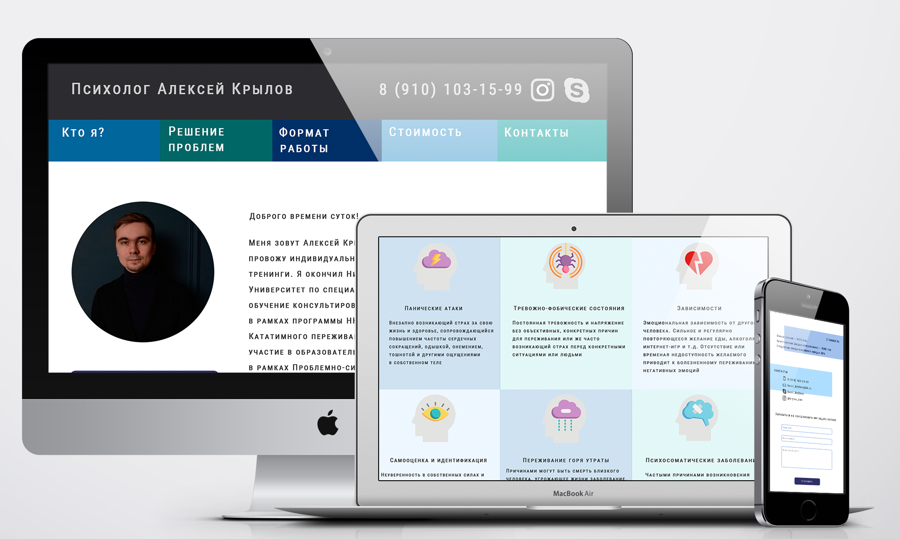

# Сайт для психолога Алексея Крылова
Вторая версия сайта (2020 г.) Первую можно посмотреть [здесь](https://github.com/IVKrylova/psychologist-Krylov_version1).

 

## Описание
Проект - сайт-визитка для психолога Алексея Крылова. 
Моя задача - обновить дизайн, актуализировать информацию на сайте, убрать календарь и административную часть, добавить Политику конфиденциальности и сообщение о cookies.
 

## Используемые технологии
1. HTML5, CSS3
2. Флексбокс-верстка, Grid-css, oтзывчивая вёрстка
3. Кроссбраузерность
4. JavaScript, jQuery
5. PHP 7
6. Библиотеки Owl-carousel, Masked, Lightbox
 

## Инструменты
1. Photoshop
2. Денвер
3. Яндекс.Метрика
4. Google Analytics
5. reCAPTCHA
6. FileZilla
 

## Дизайн
 
 

## Планы по доработке проекта
* Переписать сайт с PHP на React.
* Добавить англоязычную версию сайта.
* Добавить возможность записи на консультацию через каландарь.
* Написать бэкенд на node.js с использованием фреймворка Express.
* Перенести сайт на VDS.
 

## Демо
Сейчас сайт доступен по адресу [www.alekseykrylov.ru](https://www.alekseykrylov.ru/). 
Посмотреть скринкаст по сайту можно [здесь](https://youtu.be/0Z0gxhXNHv4). 
Посмотреть фтонтенд третьей версии сайта можно [здесь](https://github.com/IVKrylova/psychologist-krylov), бэкенд - [здесь](https://github.com/IVKrylova/psychologist-krylov-api).

### Авторское право
Автор иконок на сайте: [Freepik](https://www.freepik.com/) from [Flaticon](https://www.flaticon.com/)
